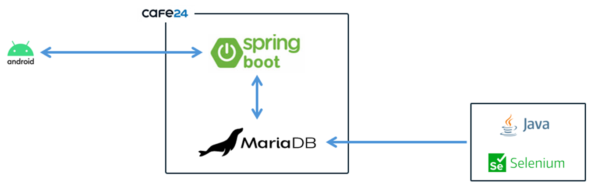
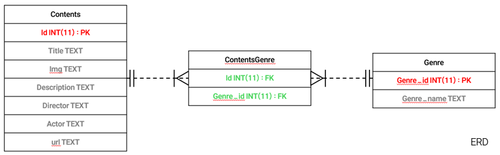
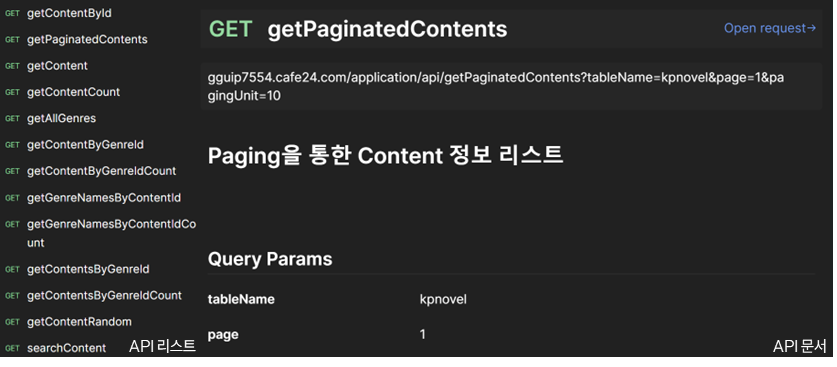
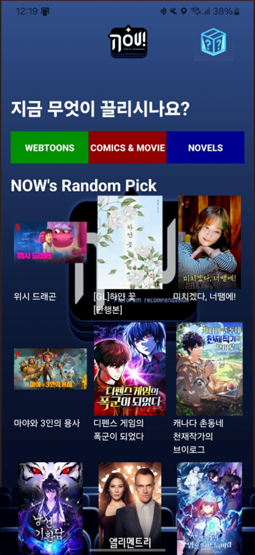
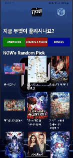

# 문화 생활 애플리케이션

웹툰, 웹소설, OTT 등을 랜덤으로 추천해주는 애플리케이션

## 📌 프로젝트 소개

개발 기간 : 2021.03.12 ~ 2021.06.09

개발 인원 : 5명

| 이름 | 역할 | 담당 업무 | GitHub |
|------|------|-----------|--------|
| 🧑‍💻 이기용 | 팀장 / 백엔드 |  | [@gguip1](https://github.com/gguip1) |
| 🧑‍💻 서재원 | 데이터 수집, 프론트엔드 |  | - |
| 🧑‍💻 손창민 | 데이터 수집, 프론트엔드 |  | [@aronmin](https://github.com/aronmin) |
| 🧑‍💻 이상민 | UI 디자인, 프론트엔드 |  | [@Lsmini](https://github.com/Lsmini) |
| 🧑‍💻 이한세 | UI 디자인, 프론트엔드 |  | - |

## ✨ 주요 기능

- 웹툰, 웹소설, OTT 등 랜덤 추천
- 웹툰, 웹소설, OTT 등 카테고리별 추천
- 추천한 컨텐츠에 대한 정보 제공

## 📚 기술 스택
### 🖥️ Frontend  

🔗 [애플리케이션](https://github.com/gguip1/GamjaProject_Now)

### 🛠️ Backend  

### 🚀 Deployment  

## 🗂️ 시스템 구성도

## 🗂️ 데이터베이스

## 📦 API 명세서

## 📸 스크린샷

  
  

## 📸 Preview

  

