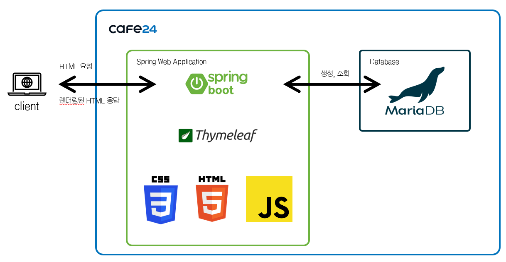
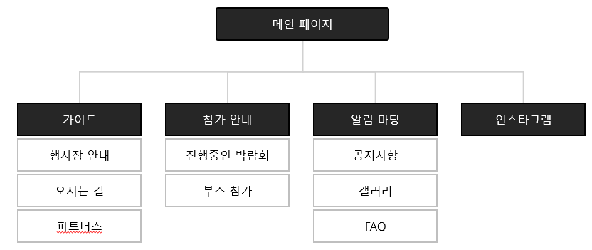
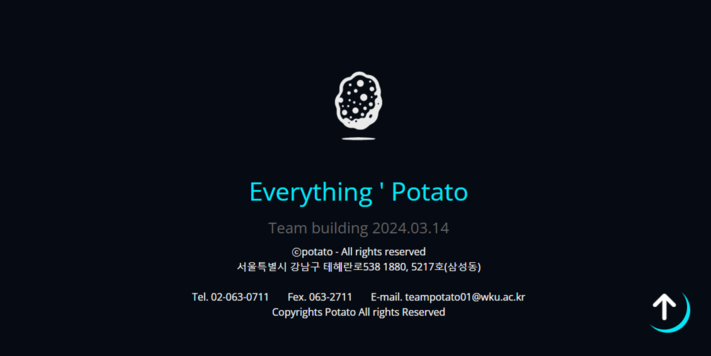
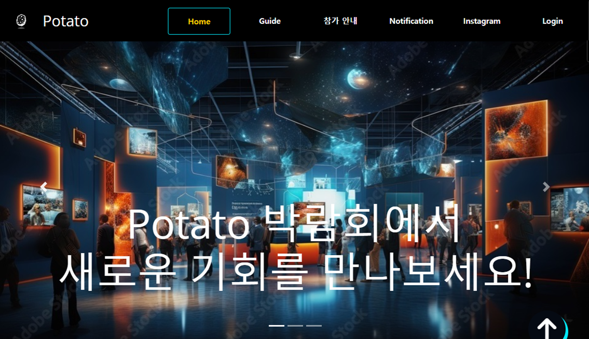
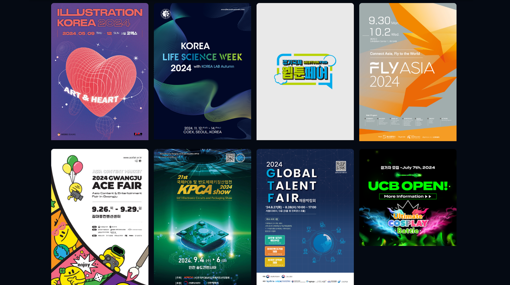

# 박람회 소개 웹페이지

각종 박람회 정보를 모아서 쉽게 확인할 수 있도록 제공하는 웹 서비스입니다. 사용자가 다양한 박람회 정보를 간편하게 접근하고 필요한 정보를 신속히 찾을 수 있도록 설계되었습니다.

## 📌 프로젝트 개요

- **개발 기간** : 2021.03.12 ~ 2021.06.09
- **개발 인원** : 5명

| 이름      | 역할                | 담당 업무                                                     | GitHub                                            |
|-----------|---------------------|---------------------------------------------------------------|---------------------------------------------------|
| 🧑‍💻 이기용 | 팀장 / 백엔드 개발자 | - 프로젝트 전체 설계 및 DB 설계 - 회원가입 및 로그인 기능 구현 - SSR(Thymeleaf) 처리 | [@gguip1](https://github.com/gguip1)              |
| 🧑‍💻 서재원 | 데이터 수집 / 프론트엔드 개발자 | - 박람회 데이터 수집 및 관리 - 참가 안내 및 로그인 페이지 구현             | -                                                 |
| 🧑‍💻 손창민 | 데이터 수집 / 프론트엔드 개발자 | - 박람회 데이터 수집 및 관리 - 참가 안내 및 알림 마당 페이지 구현           | [@aronmin](https://github.com/aronmin)            |
| 🧑‍💻 이상민 | UI 디자인 / 프론트엔드 개발자 | - 전체 UI/UX 디자인 - 참가 안내, 알림 마당, 지난 박람회 페이지 구현        | [@Lsmini](https://github.com/Lsmini)              |
| 🧑‍💻 이한세 | UI 디자인 / 프론트엔드 개발자 | - 전체 UI/UX 디자인 - 가이드 및 지난 박람회 페이지 구현                    | -                                                 |

## 🎯 프로젝트 목적

- 다양한 박람회 정보를 한곳에서 편리하게 확인할 수 있도록 지원합니다.
- 사용자들이 관심있는 박람회 참가 정보를 쉽게 접근할 수 있도록 합니다.

## ✨ 주요 기능

- **박람회 정보 조회**: 현재 진행 중인 박람회 정보를 확인합니다.
- **박람회 참가 안내**: 박람회 참가 방법과 신청 절차를 안내합니다.
- **알림 마당**: 갤러리 및 공지사항을 제공합니다.

## 📚 기술 스택

### 🖥️ Frontend

### 🛠️ Backend

### 🚀 Deployment

## 🗃️ 데이터베이스 설계

박람회 정보 관리를 위해 데이터베이스는 다음과 같이 설계되었습니다:

| 필드명   | 설명                          | 데이터 타입            |
|----------|-------------------------------|------------------------|
| id       | 박람회 고유 번호 (기본 키)     | INT, AUTO_INCREMENT    |
| name     | 박람회 이름                    | VARCHAR(255)           |
| img_url  | 썸네일 이미지 URL              | VARCHAR(500)           |
| url      | 박람회 상세 정보 페이지 URL    | VARCHAR(500)           |
| category | 박람회 카테고리 (IT, 과학 등)  | VARCHAR(100)           |

## 🗂️ 시스템 구성도

사용자 요청 처리 과정과 서버-데이터베이스 간의 데이터 흐름 및 구조를 나타낸 구성도입니다.

## 📑 메뉴 구성도

웹페이지의 메뉴 구조를 나타내며, 페이지 간 연결 및 탐색 경로를 명확히 합니다.

## 📸 화면 구성

### 🔹 헤더(Header)

사이트의 모든 페이지에서 공통적으로 사용되는 상단 내비게이션 바입니다.

### 🔹 푸터(Footer)

사이트 하단의 정보 영역으로, 관련 링크 및 연락처 정보를 제공합니다.

### 🔹 메인 페이지

박람회 정보를 간략히 소개하며, 주요 행사로 빠르게 연결됩니다.

### 🔹 진행 중인 박람회

현재 개최 중인 박람회 정보를 상세하게 제공하여 사용자의 참여를 유도합니다.

